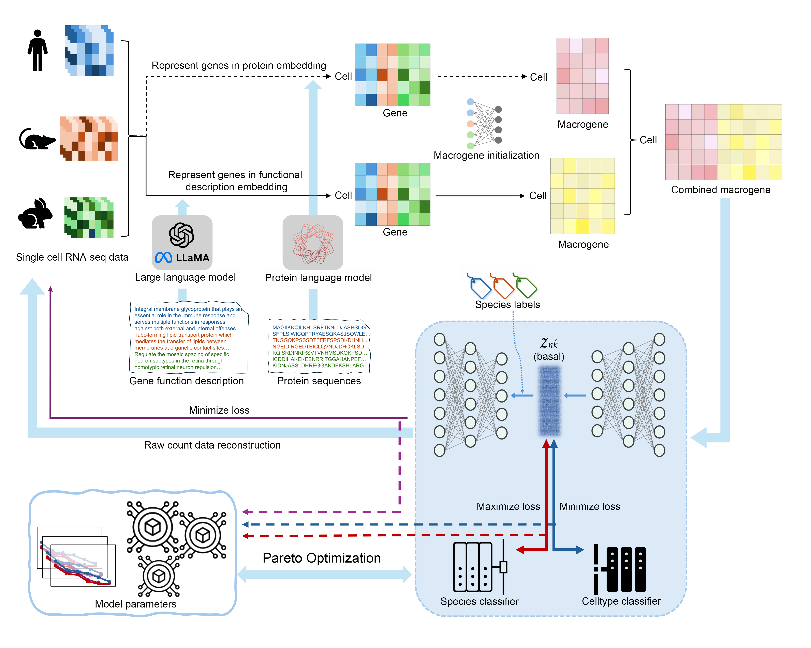

# **Galaxy: Deciphering Cellular Evolution with Universal Multimodal Embeddings**

This repository contains the code for training and generating results using the Galaxy model.

## **Overview**


**Galaxy** is a **transfer learning framework** designed to integrate single-cell RNA sequencing (**scRNA-seq**) data **across species** — even those separated by hundreds of millions of years.  
Instead of relying solely on one-to-one orthologs, Galaxy creates **functionally coherent multi-modal macrogenes** that **transcend species boundaries** by integrating:  

- **Gene expression data** (RNA-seq)  
- **Protein language model embeddings**  
- **General-purpose large language model embeddings**  

This approach allows Galaxy to:  
- ✅ Correct **technical batch effects** while preserving conserved biology  
- ✅ Capture **functionally convergent gene programs** beyond strict orthology  
- ✅ Predict **cross-species perturbation responses** (e.g., mouse → human)  
- ✅ Build **multi-species evolutionary trees** of cell types with higher accuracy  

By uniting molecular and computational insights, Galaxy opens a **new avenue for comparative single-cell genomics**, enabling biological discovery across vast evolutionary distances.  

### **Setting up Galaxy**

**Step 1:** Install the environment based on the `requirements.txt` file:  

```bash
pip install -r requirements.txt
pip install torch==1.10.2+cu113 -f https://download.pytorch.org/whl/cu113/torch_stable.html
```

**Step 2:** Generate the protein embeddings file and the gene functional description embeddings file.  

- Follow the code from [SATURN](https://github.com/snap-stanford/SATURN) to generate the protein embeddings files.  
- Follow the code from the `text_embedding` folder to generate the gene functional text description embeddings files.  

---

**Step 3:** Run the Galaxy model:  

```bash
python Galaxy_end_to_end.py \
  --output_path ./runs/exp1 \
  --h5ad_files ../data/task3_cat.h5ad ../data/task3_tiger.h5ad \
  --species_labels cat tiger \
  --celltype_labels NewCelltype NewCelltype \
  --gene_esm_embedding_path ../gene_embeddings/task3_cat.gene_symbol_to_embedding_ESM1b.pt ../gene_embeddings/task3_tiger.gene_symbol_to_embedding_ESM1b.pt \
  --gene_llama_embedding_path ../gene_go_term/all_go_gene_embedding/task3_cat_llama2-7B_gene_embedding.pt ../gene_go_term/all_go_gene_embedding/task3_tiger_llama2-7B_gene_embedding.pt \
  --eval_every 5 \
  --train_epochs 500
```

### **Galaxy output**

- **`macrogene_merged_with_galaxy.h5ad`** – AnnData file of the macrogene expressions.  
  - First 2k = ESM macrogenes  
  - Latter 2k = LLaMA macrogenes  
  - Integrated embedding is stored in `adata.obsm['X_galaxy']`.  

- **`all-esm_to_macrogenes.pkl`** – weight of each gene from each species to the ESM macrogenes.  

- **`all-llama_to_macrogenes.pkl`** – weight of each gene from each species to the LLaMA macrogenes.  

- **`*_processed_esm.h5ad`** – processed AnnData object filtered by genes with ESM protein embeddings.  

- **`*_processed_llama.h5ad`** – processed AnnData object filtered by genes with LLaMA protein embeddings.  

- **`inference_summary.json`, `best_meta.json`** – log files generated during training.  

- **`best.pt`** – best model checkpoint during training. 


### **Citing**
If you find our manuscript and code useful, please consider citing the preprint:
