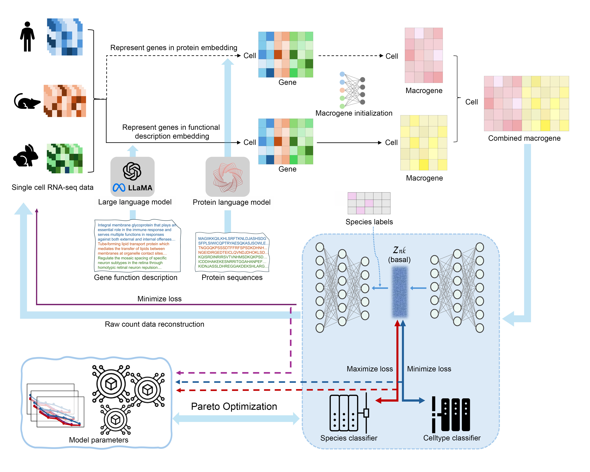

# Unify: Learning Cellular Evolution with Universal Multimodal Embeddings

This repository contains the code for training and running **Unify**, a multimodal framework for:

- **cross-species single-cell data integration**, and
- **cross-species perturbation prediction**.

The current codebase uses a **single unified command-line script** with a required `--mode` argument:

- `--mode integration`
- `--mode perturbation`

## Overview



**Unify** is a transfer learning framework designed to integrate single-cell RNA sequencing (**scRNA-seq**) data **across species**, including evolutionarily distant species. Instead of relying only on one-to-one orthologs, Unify constructs **multimodal macrogenes** by combining:

- **gene expression profiles**,
- **protein language model embeddings** (for example, ESM), and
- **gene functional text embeddings** generated from a large language model pipeline.

These macrogenes provide a shared feature space that supports both:

1. **cross-species integration**, by aligning cells across datasets while preserving biological structure, and  
2. **cross-species perturbation prediction**, by learning perturbation effects in one species and transferring them to another species.

## Main features

- Integrates scRNA-seq datasets from multiple species in a shared latent space
- Builds multimodal macrogenes from protein and functional text embeddings
- Performs end-to-end training for both integration and perturbation workflows
- Supports perturbation prediction from:
  - **source species control**
  - **source species perturbation**
  - **target species control**
  to predict **target species perturbation**
- Produces both:
  - **basal-based perturbation predictions**, and
  - **macrogene-based perturbation predictions**

## Installation

Install the Python dependencies from `requirements.txt`.

```bash
pip install -r requirements.txt
pip install torch==1.10.2+cu113 -f https://download.pytorch.org/whl/cu113/torch_stable.html
```

## Preparing the input files

Before running Unify, you need:

1. **AnnData (`.h5ad`) files**, one per species  
2. **protein embedding files**, one per species  
3. **gene functional text embedding files**, one per species

### 1. AnnData files
Each input `.h5ad` file should contain:

- cells in rows
- genes in columns
- relevant metadata stored in `adata.obs`

For **integration mode**, each dataset should contain a cell-type annotation column.

For **perturbation mode**, each dataset should contain a condition column indicating control and perturbation labels.

### 2. Protein embeddings
Follow the code from [SATURN](https://github.com/snap-stanford/SATURN) to generate gene-level protein embeddings.

### 3. Functional text embeddings
Use the code in the `text_embedding` folder to generate gene functional text description embeddings.

## Unified command-line interface

The unified pipeline is run with a required `--mode` argument:

```bash
python unify_multitask_pipeline.py --mode integration ...
```

or

```bash
python unify_multitask_pipeline.py --mode perturbation ...
```

If your script file has a different name, replace `unify_multitask_pipeline.py` with your actual filename.

---

## Mode 1: Cross-species integration

Use this mode to integrate two or more species datasets into a shared latent space.

### Required arguments

#### Shared inputs

##### `--mode`
Set to `integration`.

##### `--h5ad_files`
Two or more input AnnData (`.h5ad`) files. Each file should correspond to one species dataset.

##### `--species_labels`
Species names corresponding to the input `--h5ad_files`, in the same order.

##### `--gene_esm_embedding_path`
Paths to the protein embedding files for each species.

##### `--gene_llama_embedding_path`
Paths to the gene functional text embedding files for each species.

##### `--output_path`
Directory where output files will be saved.

#### Integration-specific

##### `--celltype_labels`
Column names in `adata.obs` that store the cell-type annotations for each dataset. The order must match `--h5ad_files`.

### Optional arguments

##### `--batch_labels`
Column name in `adata.obs` that stores batch labels.

##### `--highly_variable_genes`
Number of highly variable genes to retain during preprocessing. Default: `8000`.

##### `--num_esm_macrogene`
Number of ESM-based macrogenes. Default: `2000`.

##### `--num_llama_macrogene`
Number of LLaMA-based macrogenes. Default: `2000`.

##### `--seed`
Random seed. Default: `0`.

##### `--eval_every`
Evaluate integration ARI every `N` epochs. If omitted, the integration default is used.

##### Training and architecture arguments
If these are omitted, integration mode uses its own defaults.

- `--batch_size`
- `--train_epochs`
- `--grad_normalized_type`
- `--latent_size`
- `--macrogene_encoder_hidden_size`
- `--macrogene_encoder_dropout_ratio`
- `--macrogene_decoder_hidden_size`
- `--macrogene_decoder_dropout_ratio`
- `--hidden_size_adversary_species`
- `--hidden_size_adversary_celltype`
- `--lr_encoder`
- `--lr_generator`
- `--lr_discriminator_species`
- `--lr_discriminator_celltype`

### Integration defaults

If not manually specified, integration mode uses:

- `batch_size = 256`
- `train_epochs = 500`
- `eval_every = 5`
- `grad_normalized_type = l2`
- `latent_size = 256`
- `macrogene_encoder_hidden_size = 256`
- `macrogene_encoder_dropout_ratio = 0.2`
- `macrogene_decoder_hidden_size = 256`
- `macrogene_decoder_dropout_ratio = 0.3`
- `hidden_size_adversary_species = 256`
- `hidden_size_adversary_celltype = 256`
- `lr_encoder = 0.0008269200693451001`
- `lr_generator = 0.00010667566651855372`
- `lr_discriminator_species = 0.00015139547698955852`
- `lr_discriminator_celltype = 0.00018364960390400008`

### Example command

```bash
python unify_multitask_pipeline.py \
  --mode integration \
  --output_path ./test_result \
  --h5ad_files ./toy_data/task3_cat.h5ad ./toy_data/task3_tiger.h5ad \
  --species_labels cat tiger \
  --celltype_labels NewCelltype NewCelltype \
  --gene_esm_embedding_path ./toy_data/task3_cat.gene_symbol_to_embedding_ESM2.pt ./toy_data/task3_tiger.gene_symbol_to_embedding_ESM2.pt \
  --gene_llama_embedding_path ./toy_data/task3_cat_llama2-7B_gene_embedding.pt ./toy_data/task3_tiger_llama2-7B_gene_embedding.pt \
  --train_epochs 10 \
  --num_esm_macrogene 100 \
  --num_llama_macrogene 100 \
  --highly_variable_genes 2000
```

### Integration outputs

Running `--mode integration` produces:

- **`macrogene_merged_with_unify.h5ad`**  
  Merged macrogene AnnData with integrated embeddings stored in `adata.obsm['X_unify']`.

- **`all-esm_to_macrogenes.pkl`**  
  Mapping from each species-specific gene to its ESM macrogene weight vector.

- **`all-llama_to_macrogenes.pkl`**  
  Mapping from each species-specific gene to its LLaMA macrogene weight vector.

- **`*_processed_esm.h5ad`**  
  Per-species processed AnnData filtered to genes with ESM embeddings.

- **`*_processed_llama.h5ad`**  
  Per-species processed AnnData filtered to genes with text embeddings.

- **`best.pt`**  
  Best integration checkpoint saved during training.

- **`best_meta.json`**  
  Metadata for the best checkpoint.

- **`inference_summary.json`**  
  Summary of the final embedding generation step.

---

## Mode 2: Cross-species perturbation prediction

Use this mode to train an end-to-end perturbation model and predict the perturbation response in a target species.

### Perturbation setup

The perturbation workflow assumes your inputs contain:

- **source species control cells**
- **source species perturbation cells**
- **target species control cells**

The model then predicts:

- **target species perturbation cells**

### Required arguments

#### Shared inputs

##### `--mode`
Set to `perturbation`.

##### `--h5ad_files`
Input AnnData files, one per species.

##### `--species_labels`
Species names corresponding to `--h5ad_files`, in the same order.

##### `--gene_esm_embedding_path`
Paths to the protein embedding files for each species.

##### `--gene_llama_embedding_path`
Paths to the gene functional text embedding files for each species.

##### `--output_path`
Directory where output files will be saved.

#### Perturbation-specific

##### `--source_species`
Species used as the perturbation reference.

##### `--target_species`
Species for which the perturbation response will be predicted.

##### `--condition_key`
Column name in `adata.obs` storing the condition labels.

##### `--control_label`
Control condition label in `adata.obs[condition_key]`.

##### `--perturb_label`
Perturbation condition label in `adata.obs[condition_key]`.

### Optional arguments

##### `--batch_labels`
Column name in `adata.obs` that stores batch labels.

##### `--highly_variable_genes`
Number of highly variable genes to retain during preprocessing. Default: `8000`.

##### `--num_esm_macrogene`
Number of ESM-based macrogenes. Default: `2000`.

##### `--num_llama_macrogene`
Number of LLaMA-based macrogenes. Default: `2000`.

##### `--seed`
Random seed. Default: `0`.

##### Training and architecture arguments
If these are omitted, perturbation mode uses its own defaults.

- `--batch_size`
- `--train_epochs`
- `--latent_size`
- `--macrogene_encoder_hidden_size`
- `--macrogene_encoder_dropout_ratio`
- `--macrogene_decoder_hidden_size`
- `--macrogene_decoder_dropout_ratio`
- `--hidden_size_adversary_species`
- `--hidden_size_adversary_celltype`
- `--lr_encoder`
- `--lr_generator`
- `--lr_discriminator_species`
- `--lr_discriminator_celltype`

### Perturbation defaults

If not manually specified, perturbation mode uses:

- `batch_size = 128`
- `train_epochs = 1000`
- `latent_size = 256`
- `macrogene_encoder_hidden_size = 256`
- `macrogene_encoder_dropout_ratio = 0.2`
- `macrogene_decoder_hidden_size = 256`
- `macrogene_decoder_dropout_ratio = 0.3`
- `hidden_size_adversary_species = 256`
- `hidden_size_adversary_celltype = 256`
- `lr_encoder = 0.001`
- `lr_generator = 0.001`
- `lr_discriminator_species = 0.001`
- `lr_discriminator_celltype = 0.001`

### Example command

```bash
python unify_multitask_pipeline.py \
  --mode perturbation \
  --output_path ./perturbation_result \
  --h5ad_files ./toy_data/mouse.h5ad ./toy_data/human.h5ad \
  --species_labels mouse human \
  --gene_esm_embedding_path ./toy_data/mouse_esm.pt ./toy_data/human_esm.pt \
  --gene_llama_embedding_path ./toy_data/mouse_llama.pt ./toy_data/human_llama.pt \
  --source_species mouse \
  --target_species human \
  --condition_key cytokine \
  --control_label PBS \
  --perturb_label IFN-beta
```

### Perturbation outputs

Running `--mode perturbation` produces:

- **`final_inference_model.pt`**  
  Final one-file perturbation model containing the bundled encoder-decoder weights and metadata.

- **`<target_species>_predicted_<perturb_label>_basal.h5ad`**  
  Basal-based perturbation prediction for the target species.

- **`<target_species>_predicted_<perturb_label>_macrogene.h5ad`**  
  Macrogene-based perturbation prediction for the target species.

- **`all-gene_to_esm_macrogenes_weights.pkl`**  
  Gene-to-ESM-macrogene weight mapping used in perturbation preprocessing.

- **`all-gene_to_llama_macrogenes_weights.pkl`**  
  Gene-to-LLaMA-macrogene weight mapping used in perturbation preprocessing.

- **`*_processed_esm.h5ad`**  
  Per-species processed AnnData filtered to genes with ESM embeddings.

- **`*_processed_llama.h5ad`**  
  Per-species processed AnnData filtered to genes with text embeddings.

### Perturbation output metadata

The predicted perturbation AnnData files include metadata such as:

- target perturbation label
- `prediction_mode` (`basal` or `macrogene`)
- `source_species`
- `target_species`
- `source_control_label`
- `source_perturb_label`

---

## Important notes

- The order of the following arguments must be consistent across species:
  - `--h5ad_files`
  - `--species_labels`
  - `--gene_esm_embedding_path`
  - `--gene_llama_embedding_path`

- In **integration mode**, `--celltype_labels` must also match the same order.

- In **perturbation mode**, both `--source_species` and `--target_species` must appear in `--species_labels`, and they must be different.

- The column specified by `--condition_key` must exist in each perturbation input AnnData file.

- The labels specified by `--control_label` and `--perturb_label` must be present in the corresponding `adata.obs[condition_key]` fields.

- The perturbation workflow does not require ground-truth target perturbation data for prediction output generation.

## Citation

If you find this tool useful in your research, please cite our preprint:

[**Unify: Learning Cellular Evolution with Universal Multimodal Embeddings**](https://doi.org/10.1101/2025.09.07.674681)

### BibTeX

```bibtex
@article{zhong2025unify,
  title={Unify: Learning Cellular Evolution with Universal Multimodal Embeddings},
  author={Zhong, Huawen and Han, Wenkai and Cui, Guoxin and Gomez-Cabrero, David and Tegner, Jesper and Gao, Xin and Aranda, Manuel},
  journal={bioRxiv},
  year={2025},
  doi={10.1101/2025.09.07.674681}
}
```
